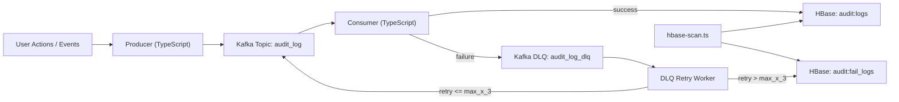

# hbase-kafka 로컬 실습

- 한국어 버전
- English (default): [`README.md`](README.md)
- 日本語: [`README.ja.md`](README.ja.md)

Kafka(3 브로커, KRaft) + HBase(1 노드) + TypeScript Producer/Consumer + 모니터링(Prometheus/Grafana/Loki)을 로컬에서 실행하는 최소 구성입니다.

## 아키텍처

`actions -> Kafka producer -> Kafka brokers -> consumer -> HBase(audit:logs) -> DLQ retry -> HBase(audit:fail_logs)`



## 사전 준비

- Docker + Docker Compose
- Node.js 20+
- `pnpm`

## 1) 이미지 pull

```bash
docker compose pull
```

## 2) 컨테이너 기동

```bash
docker compose up -d
```

## 3) 상태 확인

```bash
docker compose ps
docker compose logs -f kafka-1
docker compose logs -f kafka-2
docker compose logs -f kafka-3
docker compose logs -f hbase
docker compose logs -f kafka-ui
```

## 4) 종료

```bash
docker compose down
```

## 포트

- Kafka broker-1 external: `localhost:9092`
- Kafka broker-2 external: `localhost:9093`
- Kafka broker-3 external: `localhost:9094`
- Kafka internal bootstrap: `kafka-1:29092,kafka-2:29092,kafka-3:29092`
- HBase Master UI: `http://localhost:16010`
- HBase REST(`node-hbase` 연결 엔드포인트): `http://localhost:9090` (container `8080`)
- Kafka UI: `http://localhost:8080`
- Kafka Exporter: `http://localhost:9308/metrics`
- Prometheus: `http://localhost:9091`
- Grafana: `http://localhost:3000`
- Loki: `http://localhost:3100`
- Promtail metrics: `http://localhost:9080/metrics`

## Kafka 토픽 설정(권장)

이 3브로커 로컬 환경에서는 3 replicas + `min.insync.replicas=2`를 권장합니다.

```bash
docker exec kafka-1 kafka-topics --bootstrap-server kafka-1:29092 --create --if-not-exists --topic audit_log --partitions 3 --replication-factor 3 --config min.insync.replicas=2
docker exec kafka-1 kafka-topics --bootstrap-server kafka-1:29092 --create --if-not-exists --topic audit_log_dlq --partitions 3 --replication-factor 3 --config min.insync.replicas=2
docker exec kafka-1 kafka-topics --bootstrap-server kafka-1:29092 --describe --topic audit_log
docker exec kafka-1 kafka-topics --bootstrap-server kafka-1:29092 --describe --topic audit_log_dlq
```

## HBase 테이블 준비

shell 접속:

```bash
docker exec -it hbase hbase shell
```

테이블 생성:

```ruby
create_namespace 'audit'
create 'audit:logs', 'cf'
create 'audit:fail_logs', 'cf'
```

## TypeScript 앱 실행

의존성 설치:

```bash
pnpm install
```

Producer 실행(1회 실행 시 200건 비동기 전송):

```bash
pnpm producer
```

Consumer 실행(지속 구독):

```bash
pnpm consumer
```

Consumer 1건 처리 후 종료:

```bash
pnpm consumer:once
```

DLQ 재시도 워커 실행(`audit_log_dlq -> audit_log`, 최대 재시도 횟수는 환경변수로 제어):

```bash
pnpm dlq:retry
```

HBase JMX 메트릭 익스포터 실행:

```bash
pnpm hbase:metrics
```

`audit:logs` 조회(최대 50행):

```bash
pnpm hbase:scan
```

다음 페이지 조회:

```bash
pnpm hbase:scan -- --start-row "<row_key>"
```

실패 테이블 조회:

```bash
HBASE_TABLE=audit:fail_logs pnpm hbase:scan
```

## 모니터링/내부 로그

모니터링 스택 기동:

```bash
docker compose up -d kafka-exporter prometheus grafana loki promtail
```

앱 메트릭 엔드포인트:

- `consumer`: `http://localhost:9464/metrics`
- `dlq-retry`: `http://localhost:9465/metrics`
- `hbase-metrics`: `http://localhost:9466/metrics`

Grafana 로그인:

- id: `admin`
- pw: `admin`

Grafana에서 내부 로그 확인:

- `Explore`로 이동 후 데이터소스 `Loki` 선택
- 전체 서비스 예시: `{compose_project="hbase-kafka"}`
- 특정 서비스 예시: `{service="kafka-1"}`, `{service="hbase"}`, `{service="kafka-ui"}`

## 기본 환경변수

- `KAFKA_BROKERS` (default: `localhost:9092,localhost:9093,localhost:9094`)
- `KAFKA_TOPIC` (default: `audit_log`)
- `KAFKA_DLQ_TOPIC` (default: `audit_log_dlq`)
- `KAFKA_GROUP_ID` (default: `audit-log-consumer-ts`)
- `KAFKA_DLQ_GROUP_ID` (default: `audit-log-dlq-retry-ts`)
- `HBASE_TABLE` (default: `audit:logs`)
- `HBASE_FAIL_TABLE` (default: `audit:fail_logs`)
- `HBASE_CF` (default: `cf`)
- `HBASE_HOST` (default: `localhost`)
- `HBASE_PORT` (default: `9090`)
- `CONSUMER_METRICS_PORT` (default: `9464`)
- `DLQ_RETRY_METRICS_PORT` (default: `9465`)
- `HBASE_METRICS_PORT` (default: `9466`)
- `HBASE_JMX_URL` (default: `http://localhost:16010/jmx`)
- `CONSUMER_MAX_RETRIES` (default: `3`)

## 메시지 검증/재시도 규칙

- `id` 필수(중복 방지용 고유 식별자)
- `pattern_id` ↔ `action_type` 매핑 검증:
  - `0 -> move_url`
  - `2 -> create`
  - `3 -> edit`
  - `4 -> delete`
- HBase rowkey 형식: `pattern_id#event_time#id`
- Consumer 실패 처리:
  - HBase에는 쓰지 않음
  - `audit_log_dlq`로 전송
- `pnpm dlq:retry`가 DLQ에서 `audit_log`로 재주입
- 최대 재시도 초과 시 HBase `audit:fail_logs`에 저장

## 자주 발생하는 에러

다음 에러가 보이면:

`Messages are rejected since there are fewer in-sync replicas than required`

토픽 설정을 확인하세요:

- `replication-factor`는 `>= min.insync.replicas` 여야 함
- 이 저장소 권장값: `RF=3`, `min.insync.replicas=2`
